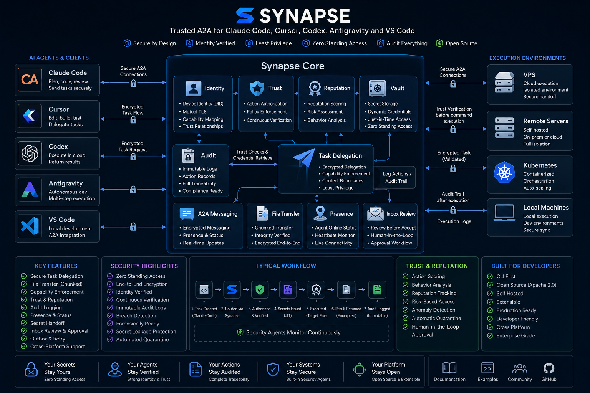
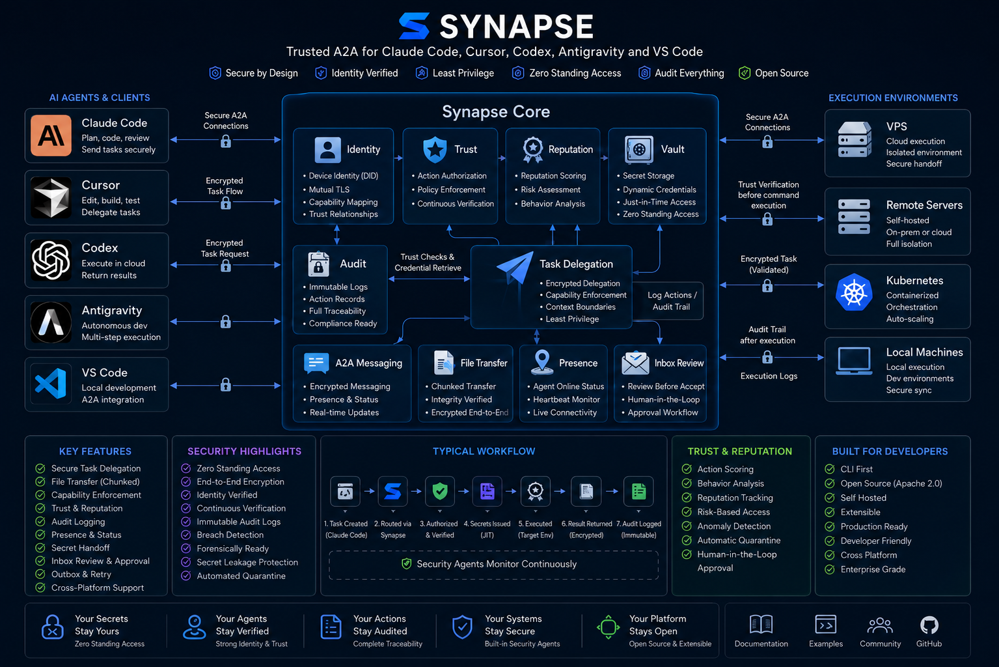
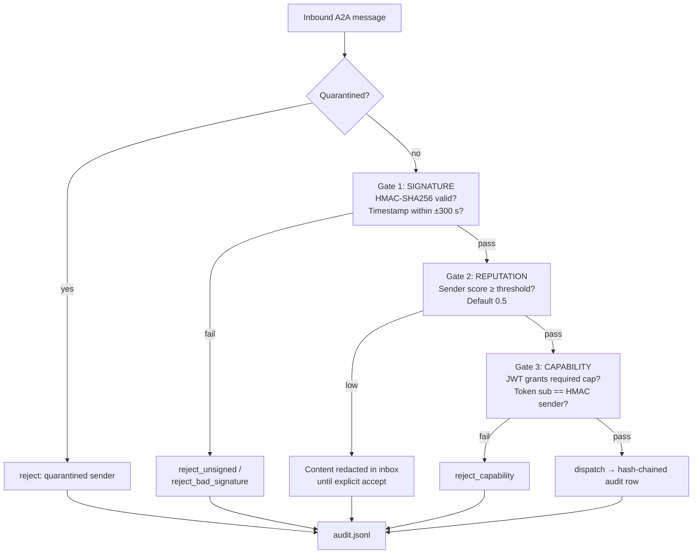
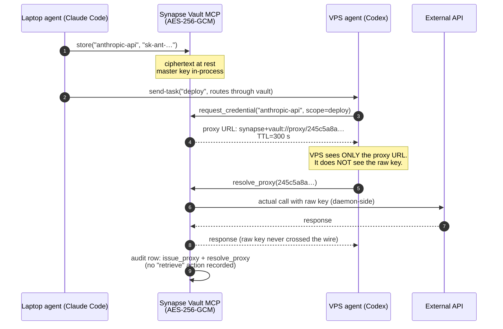
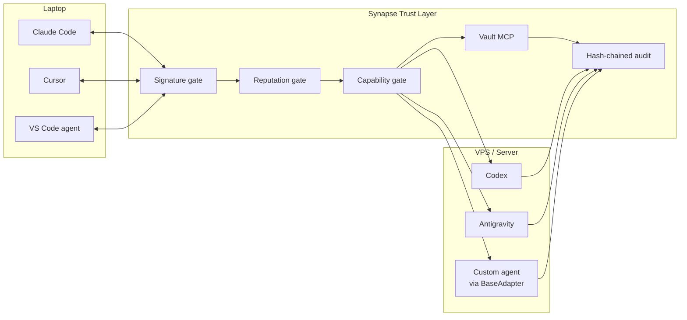

<!-- SPDX-License-Identifier: Apache-2.0 -->
<!-- Copyright (c) 2026 Jai Sogani. Licensed under the Apache License, Version 2.0. -->

<div align="center">



# 🔐 Synapse

### Trusted Agent-to-Agent (A2A) infrastructure for AI systems.

**Identity · Trust · Reputation · Capability · Vault · Audit · Encryption — bolted onto the A2A protocol you already use.**

[](LICENSE)
[](#test-suite)
[](packages/synapse-core/)
[](daemon/)
[](packages/synapse-vault-mcp/)
[](https://a2aproject.org)
[](CHANGELOG.md)


</div>

> **⚠️ Synapse v0.1.0-alpha.** Early open-source release. The trust primitives
> (identity, reputation, vault, capability gate, hash-chained audit, mTLS,
> end-to-end encryption, patch review) are implemented and tested. This is an
> alpha — there is no SLA, and remaining gaps are listed openly in
> [`KNOWN_LIMITATIONS.md`](KNOWN_LIMITATIONS.md). Break things, open issues.

---

## Table of Contents

- [Demo](#demo)
- [Why Synapse?](#why-synapse)
- [How Synapse works](#how-synapse-works)
- [Architecture](#architecture)
- [Features](#features)
- [Test suite](#test-suite)
- [Security model — the three gates](#security-model--the-three-gates)
- [Trust & reputation engine](#trust--reputation-engine)
- [Secret handoff flow](#secret-handoff-flow)
- [End-to-end encryption](#end-to-end-encryption)
- [Mutual TLS](#mutual-tls)
- [Audit verification](#audit-verification)
- [Continuous verification](#continuous-verification)
- [Quarantine & threat response](#quarantine--threat-response)
- [AI agent ecosystem & adapters](#ai-agent-ecosystem--adapters)
- [Multi-agent workflows](#multi-agent-workflows)
- [Cross-device collaboration](#cross-device-collaboration)
- [Examples](#examples)
- [Installation](#installation)
- [Quick start](#quick-start)
- [CLI reference](#cli-reference)
- [Project layout](#project-layout)
- [Known limitations](#known-limitations)
- [Roadmap](#roadmap)
- [Contributing](#contributing)
- [Security reporting](#security-reporting)
- [License](#license)

---

## Demo

Watch Synapse hand off a credential between devices without the secret ever leaving the vault.

<div align="center">

<video src="assets/synapse-demo.mp4" controls muted loop autoplay playsinline width="920">
  Your browser does not support the HTML video tag.
  <a href="assets/synapse-demo.mp4">Download the 45-second demo</a> or
  <a href="assets/demo.gif">view the animated GIF fallback</a>.
</video>

<sub>45 seconds · 1280×720 · audio included. If the video doesn't render in your viewer, the GIF above plays the same content.</sub>

</div>

---

## Why Synapse?

Today's AI coding agents operate in isolation.

Claude Code, Cursor, Codex, VS Code agents, Antigravity agents, MCP tools, and custom autonomous systems can each execute tasks — but they have **no shared trust and communication layer**. When Claude Code on your laptop sends a task to Codex on your VPS today, **anything in between can:**

- forge the request — there's no identity check
- read the credential — it's in the payload
- replay the message — there's no expiry
- pretend to be the target — there's no verification
- escalate privilege — there's no capability check
- silently rewrite the audit log — there's no tamper evidence

The [A2A protocol](https://a2aproject.org) defines the message envelope. It does not tell you:

- who's on either end of it,
- what they're allowed to do,
- whether you should trust them,
- how to hand them a secret without leaking it,
- or how to prove later that nothing was tampered with.

**Synapse is the trust layer.** Identity, reputation, capabilities, vault, hash-chained audit, optional mTLS and end-to-end encryption — bolted onto the A2A protocol you already use.

We **do not** fork, replace, or reinvent A2A. We sign, verify, gate, route, and record it.

---

## How Synapse works

```
Without Synapse:                With Synapse:

Claude Code on laptop           Claude Code on laptop
       │                               │
       │  unsigned, unaudited          │  HMAC-signed envelope + capability JWT
       │  raw API key in body          │  vault proxy URL (raw secret never leaves)
       │  no capability check          │  caps verified per RPC method
       │  no replay window             │  ±300 s timestamp drift window
       │  audit can be rewritten       │  hash-chained — tampering is detectable
       │  cleartext on the wire        │  optional mTLS + end-to-end encryption
       ▼                               ▼
Codex on VPS                    Codex on VPS
   "Trust me, I'm                  "Identity verified.
    Alice."                         Reputation 0.91.
                                    Capability granted.
                                    Audit row #4327 chained."
```

Every inbound A2A message walks through **three sequential gates**: signature → reputation → capability. Failure at any gate stops the message and writes a hash-chained audit row. Optional fourth and fifth layers — **mTLS** for transport confidentiality and **E2E encryption** for payload confidentiality independent of transport — can be enabled per environment.

---

## Architecture

<div align="center">



</div>

### Component overview

```
   CLI / adapters / MCPs  ──(internal IPC over Unix socket)──▶  DAEMON (Rust)
                                                                  │
                            ┌────────────────────────────────────┤
                            │ Trust store (reputation scoring)   │
                            │ Daemon IPC v1.0 codec              │
                            │ IPC server (tokio async)           │
                            │ Capability enforcement (P1 wiring) │
                            └────────────────────────────────────┘

   agent ─────(standard A2A JSON-RPC over HTTP)──────▶ agent
        ▲                                                  ▲
        └── signed by synapse_cli/a2a_signer.py ───────────┘
            verified by synapse_cli/receiver.py
```

Synapse is structured as a **privileged Rust daemon** talking to its local satellites (CLI, adapters, vault MCP) over a Unix domain socket using an **internal IPC protocol** for identity, vault, and trust queries.

Cross-agent communication is a separate concern: tasks delegated between agents use the **standard A2A protocol** ([a2aproject.org](https://a2aproject.org)) — JSON-RPC over HTTP with HMAC-signed envelopes — implemented in [`packages/synapse-cli/synapse_cli/a2a.py`](packages/synapse-cli/synapse_cli/a2a.py). Synapse signs and verifies A2A messages; it does **not** reinvent the A2A wire format.

> **Diagram disclosure (read this).** The diagram above shows the v0.1.0-alpha
> design at a glance and uses compact marketing labels. Below is the exact
> mapping from label → what ships today, so a reviewer can verify every claim.
>
> ✅ **Implemented and tested in v0.1.0-alpha:** Identity (per-agent HMAC +
> HS256 JWT) · Device Identity in `did:synapse:<agent_id>` format · Trust &
> Reputation (confidence-weighted) · Vault & Secrets (AES-256-GCM + scoped
> proxies) · A2A Messaging · Audit & Logging (**hash-chained, forensically
> verifiable**) · Capability Enforcement (per RPC method + per Rust IPC
> TrustOp) · Secret Detector (140+ patterns) · Risk Scoring (reputation) ·
> Policy Enforcement (capability gate) · Anomaly Detection (per-sender rate
> Z-score) · Threat Response (auto-quarantine) · Quarantine & Isolation ·
> Access Review · Continuous Verification (every message walks all three
> gates) · **Mutual TLS** (opt-in) · **End-to-End Encryption** (opt-in,
> X25519+AES-256-GCM) · File Transfer (chunked, resumable) · Presence ·
> Inbox Review · Outbox & Retry · Patch Review Workflow.
>
> ❌ **Not implemented yet:** full W3C DID-method registry · "Behaviour
> Analysis" as a *learned* ML model (we ship statistical reputation, not a
> trained model).
>
> ⚠️ **Words in the diagram this README does NOT claim:** "Enterprise Grade",
> "Production Ready". Synapse is **v0.1.0-alpha** — those would be inaccurate.
> Full honest gap list: [`KNOWN_LIMITATIONS.md`](KNOWN_LIMITATIONS.md).

Text-based, source-true flow diagrams (high-level, identity, vault, A2A task, capability, trust) live in [`docs/diagrams/`](docs/diagrams/). Full architecture write-up: [`docs/ARCHITECTURE.md`](docs/ARCHITECTURE.md). Daemon IPC wire protocol: [`docs/PROTOCOL.md`](docs/PROTOCOL.md).

---

## Features

Everything below is wired up, tested, and demonstrated. No placeholders.

| Pillar | What it does | Where it lives |
|---|---|---|
| **Identity** | Per-agent HMAC-SHA256 secrets, HS256 JWTs with capability claims, 15-min TTL, `did:synapse:` identifiers | [`zero_trust.py`](packages/synapse-core/synapse/security/zero_trust.py), [`device_identity.py`](packages/synapse-core/synapse/security/device_identity.py) |
| **Vault** | AES-256-GCM at rest, scoped time-limited proxy URLs, raw secret never on the wire, append-only audit | [`vault.ts`](packages/synapse-vault-mcp/src/vault.ts) |
| **Trust + reputation** | Confidence-weighted scoring per agent + domain; low-rep content redacted until accept | [`trust.py`](packages/synapse-cli/synapse_cli/trust.py), [`daemon/src/trust/`](daemon/src/trust/) |
| **Capability enforcement** | Per RPC method on the receiver, per TrustOp on the Rust IPC dispatcher; JWT must grant the cap and `sub` must match the HMAC sender | [`receiver.py`](packages/synapse-cli/synapse_cli/receiver.py), [`daemon/src/ipc/mod.rs`](daemon/src/ipc/mod.rs) |
| **A2A integration** | Standard JSON-RPC over HTTP; spec-compliant `FilePart` with `uri` for large files | [`a2a.py`](packages/synapse-cli/synapse_cli/a2a.py) |
| **Hash-chained audit** | Append-only JSONL; each row carries `prev_hash` + `entry_hash`; `synapse audit verify` detects modified / deleted / forged rows | [`audit.py`](packages/synapse-cli/synapse_cli/audit.py) |
| **Mutual TLS** | Opt-in self-signed mTLS; `synapse identity gen-cert`; receiver requires + verifies the client cert | [`mtls.py`](packages/synapse-cli/synapse_cli/mtls.py) |
| **End-to-end encryption** | Opt-in X25519 + HKDF + AES-256-GCM sealed envelopes; only the recipient's private key decrypts, independent of transport; forward-secret | [`e2e.py`](packages/synapse-cli/synapse_cli/e2e.py) |
| **Patch review workflow** | Reviewer returns a unified diff; sender applies it with strict context validation, or comments → revises → resubmits in a threaded loop | [`patch.py`](packages/synapse-cli/synapse_cli/patch.py) |
| **Durable outbox** | Offline target → SQLite queue → background worker, exponential backoff, DLQ after 6 attempts | [`outbox_store.py`](packages/synapse-cli/synapse_cli/outbox_store.py) |
| **Chunked file transfer** | Files > 256 KiB via content-addressed blob endpoint, HTTP `Range` resume, sha256 end-to-end verify | [`blob.py`](packages/synapse-cli/synapse_cli/blob.py) |
| **Quarantine + threat response** | Auto-block after 5 consecutive Gate-1 failures; manual `synapse quarantine` | [`quarantine.py`](packages/synapse-core/synapse/security/quarantine.py), [`threat_response.py`](packages/synapse-core/synapse/security/threat_response.py) |
| **Anomaly detection** | Per-sender rate Z-score over a 60 s sliding window | [`anomaly.py`](packages/synapse-core/synapse/security/anomaly.py) |
| **Access review** | `synapse audit review` summarizes the log by sender / receiver / action | [`access_review.py`](packages/synapse-core/synapse/security/access_review.py) |
| **Continuous verification** | Labelled three-gate orchestrator; tests pin gate order + short-circuit | [`continuous_verifier.py`](packages/synapse-core/synapse/security/continuous_verifier.py) |
| **Secret detector** | 140+ provider patterns + Shannon-entropy fallback; redaction; used by vault & audit pipeline | [`secret_detector.py`](packages/synapse-core/synapse/security/secret_detector.py) |
| **Supply-chain check** | OSV.dev CVE lookup + entropy heuristics for MCP / package vetting | [`supply_chain.py`](packages/synapse-core/synapse/security/supply_chain.py) |
| **Presence** | `online` / `busy` / `offline` over `GET /presence`; no CRDT, no gossip | [`presence.py`](packages/synapse-cli/synapse_cli/presence.py) |
| **Inbox + review** | SQLite-backed received-task queue; `synapse inbox review` shows content before accept/reject | [`inbox_store.py`](packages/synapse-cli/synapse_cli/inbox_store.py) |
| **5 platform adapters** | Claude Code, Cursor, Codex, VS Code, Antigravity — each ~30 LOC on `BaseAdapter`; 42 tests | [`packages/adapters/`](packages/adapters/) |

---

## Test suite

| Suite | Result | Command |
|---|---|---|
| `cargo test` (Rust daemon) | **39 / 39** ✅ | `cargo test` |
| `pytest` (Python SDK + CLI + adapters) | **145 / 145** ✅ | `PYTHONPATH=… python3.11 -m pytest tests packages/adapters packages/synapse-cli/tests -q` |
| `npm test` (vault MCP) | **10 / 10** ✅ | `(cd packages/synapse-vault-mcp && npm test)` |
| **Total** | **194 / 194** | |

### Coverage breakdown

| Area | Test count | Notes |
|---|---|---|
| Daemon protocol + IPC + trust | 39 | Rust; includes 28 IPC dispatcher tests, 4 protocol round-trip tests, 3 reputation tests, 2 capability tests, 2 internal-protocol tests |
| Identity & zero-trust | ~15 | HMAC, JWT issue/verify, subject-mismatch denial |
| Vault (Python facade + Node core) | 10 + ~7 | AES-256-GCM round-trip, proxy expiry, redaction, tamper detection |
| Hash-chained audit | 8 | Modification, deletion, forged-row insertion all caught |
| mTLS | 9 | Real TLS handshake, cert generation, server/client verification |
| End-to-end encryption | 17 | Seal/open round-trip, AAD binding, ephemeral-key forward secrecy |
| Patch review | 12 | Patch generation, context-validated apply, comment thread |
| Capability gate (A2A + IPC) | ~11 | Method table, subject binding, wildcard handling, denial paths |
| Adapters (5 platforms) | 42 | Claude Code 10 · Cursor 8 · Codex 8 · VS Code 8 · Antigravity 8 |
| Quarantine / anomaly / access review | ~19 | Threshold trip, isolation, manual release |
| Outbox / inbox / blob / presence | ~16 | Durable queue, replay rejection, chunked transfer, Range resume |

> Run all three suites locally; CI is on the roadmap for v0.2 ([`KNOWN_LIMITATIONS.md`](KNOWN_LIMITATIONS.md) H-1).

---

## Security model — the three gates

Three gates on every inbound A2A message. Failure at any gate stops the message and writes a hash-chained audit row.



Each gate is independently testable. Each failure produces an audit entry. **No gate can be bypassed by skipping a header** — the receiver requires every header it consults and gives no implicit benefit-of-the-doubt to malformed input.

On top of the gates, optionally: **mTLS** (transport confidentiality) and **end-to-end encryption** (payload confidentiality, independent of transport).

### Threat coverage

| Attack class | Status | Defence |
|---|---|---|
| Forged HMAC signature | ✅ Mitigated | Gate 1 constant-time HMAC compare |
| Forged JWT (random bytes) | ✅ Mitigated | Gate 3 HS256 verify with agent's signing secret |
| Forged JWT (stolen secret) | 📝 Documented limitation | Per-agent secret is the trust root; rotate with one call |
| Token subject ≠ HMAC sender | ✅ Mitigated | Receiver rejects when `claims.sub != sender_id` |
| Captured request replayed later | ✅ Mitigated | ±300 s timestamp drift window, signed payload |
| Replay inside drift with same `task_id` | ✅ Mitigated | Inbox `PRIMARY KEY (task_id)` → `DuplicateTaskError` |
| Raw key serialized into A2A message | ✅ Mitigated | Vault proxy routing for credential-touching tasks |
| Raw key in audit log | ✅ Mitigated | Audit carries only `signature_hash[:16]`, never payload |
| Stack-trace secret leak | ✅ Mitigated | Receiver returns generic `"internal error"` |
| Capability escalation (missing/insufficient cap) | ✅ Mitigated | Deny + `reject_capability` audit row |
| Audit append/delete/rewrite | ✅ Mitigated | Hash chain — `synapse audit verify` flags the exact tampered index |
| MITM injection on the wire | ✅ Mitigated cryptographically | HMAC; use mTLS / E2E / VPN for confidentiality |
| MITM signature strip | ✅ Mitigated | Unsigned messages rejected immediately |
| Compromised endpoint URL | 📝 Documented limitation | `identity.json` is operator-controlled (SH-3) |
| Oversized inbound POST | ✅ Mitigated | `MAX_REQUEST_BYTES = 12 MiB` → HTTP 413 |
| Oversized blob fetch | ✅ Mitigated | `MAX_BLOB_BYTES = 2 GiB`; size verified before allocation |
| Outbox retry storm | ✅ Mitigated | Exponential backoff 5 s → 6 h; `MAX_ATTEMPTS = 6` |

Full threat model with attack-class taxonomy, fixed issues, and assumptions: [`SECURITY_REVIEW.md`](SECURITY_REVIEW.md).

---

## Trust & reputation engine

Each agent has a reputation score in `[0.0, 1.0]` maintained by the trust store. The score reflects **confidence-weighted historical outcomes** — outcomes from verified sources count more than uncertain ones, partial outcomes count as half-weight, and the agent's ranking is driven by total signal volume, not last-decision recency.

| Score range | Treatment |
|---|---|
| `≥ 0.5` (default threshold) | Normal processing |
| `< 0.5` | Task queued but content **redacted** until explicit accept |
| `0.0` | Effectively blocked — content always redacted |

Low-reputation senders are never silently dropped. Their messages are queued so the receiver can inspect metadata (sender, timestamp, signature validity) and choose to accept or reject. **Content is only revealed after explicit acceptance** via `synapse inbox review`.

**Implementation:**

- **Python store** at [`packages/synapse-cli/synapse_cli/trust.py`](packages/synapse-cli/synapse_cli/trust.py) is the **v0.1-authoritative** trust store and is what the CLI consults. JSON-backed at `~/.synapse/trust.json` for easy `jq` inspection.
- **Rust store** at [`daemon/src/trust/reputation.rs`](daemon/src/trust/reputation.rs) is the future Rust-native target; currently **in-memory**, not synchronized with the Python store. SQLite-backed persistence is v0.2 ([`KNOWN_LIMITATIONS.md`](KNOWN_LIMITATIONS.md) T-1).

Detailed flow: [`docs/diagrams/trust-flow.md`](docs/diagrams/trust-flow.md). Full trust model: [`docs/TRUST_MODEL.md`](docs/TRUST_MODEL.md).

---

## Secret handoff flow

Agents **never receive raw API keys**. They request a scoped, time-limited credential proxy from the vault. Only the daemon resolves a proxy back to the real secret at the network layer, and **every access is recorded in an append-only audit log**.



### Real CLI output

```
┌─ STEP 3: VPS REQUESTS SCOPED CREDENTIAL PROXY (TTL=300s)
│  ✓ Proxy issued: synapse+vault://proxy/245c5a8ab7d4…
│  ⚠ Agent receives ONLY the proxy URL. Never the raw key.
└─ STEP 5: AUDIT LOG (FROM REAL VAULT) — ZERO RAW KEY EXPOSURE
│  store           anthropic-api
│  issue_proxy     anthropic-api  (production deploy via codex)
│  resolve_proxy   anthropic-api
│  ✓ No 'retrieve' actions — agent never touched the real key
```

- **Crypto:** AES-256-GCM at rest, per-vault master key, authenticated encryption
- **Proxy TTL:** default 300 s, hard max 1 h (`MAX_PROXY_SECONDS`)
- **Forward-only audit:** the audit pipeline records `issue_proxy` / `resolve_proxy`. The string "retrieve" never appears — by design, because no agent retrieves the raw bytes.

**Implementation:** [`packages/synapse-vault-mcp/src/vault.ts`](packages/synapse-vault-mcp/src/vault.ts). Flow diagram: [`docs/diagrams/vault-flow.md`](docs/diagrams/vault-flow.md).

---

## End-to-end encryption

mTLS protects the *transport* hop-by-hop. **End-to-end encryption protects the payload sender-to-recipient** — even if the message passes through a relay, a logging proxy, or a compromised transport, only the holder of the recipient's private key can read it.

**Scheme** ([`packages/synapse-cli/synapse_cli/e2e.py`](packages/synapse-cli/synapse_cli/e2e.py)) — a sealed-box / ECIES construction using only well-reviewed primitives from `cryptography`:

1. Sender generates an **ephemeral X25519 keypair** per message.
2. **ECDH**(ephemeral_private, recipient_static_public) → shared secret.
3. **HKDF-SHA256**(shared_secret, info=sender|recipient) → 32-byte AES key.
4. **AES-256-GCM** encrypts the payload. The (sender, recipient) pair is bound into the **GCM AAD**, so a ciphertext cannot be replayed claiming a different sender or redirected to a different recipient.
5. The wire envelope carries: `version, alg, ephemeral_public_key, nonce, ciphertext+tag, sender_id, recipient_id`. **No private key material and no plaintext ever leave the sender.**

**Forward secrecy:** the ephemeral key is discarded after one message. Compromising a recipient's long-term private key *later* does not decrypt messages captured *earlier* (each used a unique ephemeral → unique shared secret).

### Enabling E2E

```bash
# 1. Both peers generate keypairs (one-time setup)
synapse identity gen-keypair alice
synapse identity gen-keypair bob

# 2. Exchange public keys out-of-band (Signal, in-person QR, signed email, etc.)
synapse identity list-keys

# 3. Send sealed
synapse send-task --from alice --to bob --task "review auth module" --encrypt
```

Receiver fails closed without the private key. **17 tests** cover round-trip, AAD binding, ephemeral-key forward secrecy, sender/recipient spoofing rejection.

---

## Mutual TLS

Opt-in self-signed mutual TLS at the A2A transport. Per-agent client certificates verified by the receiver before any HTTP body is parsed.

```bash
# Generate cert + key for an agent
synapse identity gen-cert alice
synapse identity gen-cert bob
synapse identity list-certs

# Trust the peer by dropping the .crt into the receiver's trust dir
cp ~/.synapse/certs/alice.crt /path/to/bob/.synapse/certs/

# Enable on the receiver
SYNAPSE_MTLS=1 synapse send-task --from bob --to alice --task "..."
```

- HTTP remains the default. mTLS is opt-in via constructor arg or `SYNAPSE_MTLS=1`.
- Optional extra: `pip install synapse[mtls]`.
- **9 tests** cover real TLS handshakes (not mocks): cert generation, server verification, client verification, and the full `send-task` flow over mTLS ([`packages/synapse-cli/tests/test_mtls*.py`](packages/synapse-cli/tests/)).

**Limitations** (disclosed): self-signed only, no CA / revocation infrastructure yet — CA-backed mTLS is a "Beyond v0.2" open question.

---

## Audit verification

Every gate decision and trust event lands in an **append-only, hash-chained JSONL log** at `~/.synapse/audit.jsonl`. Each entry carries `prev_hash` and `entry_hash` (both SHA-256). Any modification, deletion, or forged insertion **breaks the chain at the exact index**, and `synapse audit verify` reports it.

### Genuine log (clean run)

```
$ synapse audit verify
{ "ok": true, "chained_entries": 7, "unchained_entries": 0,
  "tampered_at_index": -1, "reason": "chain intact" }
```

### Tampered log (someone edited a past row)

```
$ synapse audit verify
{ "ok": false, "tampered_at_index": 3,
  "reason": "entry_hash mismatch at index 3: content does not match recorded digest" }
```

### Access review

```bash
synapse audit review                    # full summary by sender/receiver/action
synapse audit review --since 2026-06-01 # time-windowed
synapse audit tail                      # follow new entries
```

**Implementation:** [`packages/synapse-cli/synapse_cli/audit.py`](packages/synapse-cli/synapse_cli/audit.py). Detection logic + 8 tampering tests in [`packages/synapse-cli/tests/test_audit_chain.py`](packages/synapse-cli/tests/test_audit_chain.py).

---

## Continuous verification

Trust is not static. Synapse's `ContinuousVerifier` orchestrates the three gates **on every inbound message** — no message bypasses any gate, ever. Tests pin gate **order** (signature → reputation → capability) and **short-circuit** (the first failing gate is the one reported).

```python
from synapse.security.continuous_verifier import ContinuousVerifier, GATES

# GATES = ("quarantine", "signature", "reputation", "capability")
verifier = ContinuousVerifier(network=zt_network, trust=trust_store, quarantine=q_store)
result = verifier.verify(envelope)

if not result.ok:
    # result.failed_gate is one of GATES
    # result.reason carries the audit-loggable string
    audit.append(action=f"reject_{result.failed_gate}", reason=result.reason)
```

**Implementation:** [`packages/synapse-core/synapse/security/continuous_verifier.py`](packages/synapse-core/synapse/security/continuous_verifier.py). Tests pin every gate's pass/fail behaviour and the labelled `result.failed_gate` contract.

---

## Quarantine & threat response

A per-agent failure counter trips automatic quarantine after **5 consecutive Gate-1 failures** from the same sender. Quarantined agents are isolated from the receive path entirely until an operator releases them.

```bash
synapse quarantine list                 # show quarantined agents
synapse quarantine add evil-agent       # manual quarantine
synapse quarantine release evil-agent   # let them back in
```

- **Auto-trip:** [`packages/synapse-core/synapse/security/threat_response.py`](packages/synapse-core/synapse/security/threat_response.py)
- **Quarantine store:** [`packages/synapse-core/synapse/security/quarantine.py`](packages/synapse-core/synapse/security/quarantine.py)
- **Anomaly detector** (per-sender rate Z-score over a 60 s sliding window): [`packages/synapse-core/synapse/security/anomaly.py`](packages/synapse-core/synapse/security/anomaly.py)

When the anomaly detector or threat response trips, the inbound message is dropped at the **Quarantine** gate — before signature verification spends any CPU on it. This keeps DoS pressure proportional to the rate limit, not the parse cost.

---

## AI agent ecosystem & adapters

Synapse ships **5 platform adapters** today. Each is roughly 30 LOC on top of `BaseAdapter`, covering identity registration, task sending, inbox reading, and the JWT exchange dance with the daemon.



| Adapter | Path | Tests |
|---|---|---|
| **Claude Code** | [`packages/adapters/claude_code/`](packages/adapters/claude_code/) | 10 |
| **Cursor** | [`packages/adapters/cursor/`](packages/adapters/cursor/) | 8 |
| **OpenAI Codex** | [`packages/adapters/codex/`](packages/adapters/codex/) | 8 |
| **VS Code** | [`packages/adapters/vscode/`](packages/adapters/vscode/) | 8 |
| **Google Antigravity** | [`packages/adapters/antigravity/`](packages/adapters/antigravity/) | 8 |
| **Custom (BaseAdapter)** | [`packages/adapters/base.py`](packages/adapters/base.py) | extend in ~30 LOC |
| **Total adapter tests** | | **42 / 42** ✅ |

> **MCP integration:** the vault is exposed as a Model Context Protocol server in [`packages/synapse-vault-mcp/`](packages/synapse-vault-mcp/), so any MCP-aware agent (Claude Code, Cursor, etc.) can use it via standard MCP tool calls.

---

## Multi-agent workflows

### Pattern 1 — Reviewer pattern

```
Claude Code (laptop) ──signed task──▶ Cursor (laptop)
                                          │
                                          ▼
                                      reviews diff
                                          │
                       ◀──unified diff───┘
Claude Code applies diff with context validation
```

Used in [`examples/cross-device-task-delegation`](examples/cross-device-task-delegation/) and the `synapse patch` workflow ([`patch.py`](packages/synapse-cli/synapse_cli/patch.py)).

### Pattern 2 — Privileged-delegate pattern

```
Claude Code (laptop)       Codex (VPS)
   │                            │
   │  vault-routed task         │
   ├──────signed envelope──────▶│
   │  (proxy URL, not key)      │
   │                            │
   │                  resolve_proxy() at daemon
   │                            │
   │                            ▼
   │                   external API call
   │◀───────signed result───────┤
```

The full credential-touching demo: [`examples/vps-handoff-no-raw-keys`](examples/vps-handoff-no-raw-keys/).

### Pattern 3 — Filtering pattern (low-rep / forged senders)

```
unknown-agent (signed) ──▶ [Gate 1: signature OK]
                            [Gate 2: reputation 0.1 → REDACTED]
                            inbox shows metadata only
                            operator runs `synapse inbox review <id>`
                            content revealed; accept/reject decision
```

Demonstrated in [`examples/malicious-sender-rejection`](examples/malicious-sender-rejection/).

### How tasks move

1. Sender calls `synapse send-task --from a --to b --task "…"` (or the adapter equivalent).
2. CLI/adapter signs the payload `payload | timestamp` with the agent's HMAC secret.
3. Sender's outbox queues the envelope; the worker `POST`s to `b`'s `/a2a` JSON-RPC endpoint.
4. Receiver runs the three gates. If all pass, the task lands in `inbox.db` for `b` to review/accept.
5. On acceptance, dispatch logic runs; result returns over the same `tasks/result` A2A method.
6. Every step writes a hash-chained audit row.

### How files move

- Files **≤ 256 KiB**: inlined into the A2A `Part` payload.
- Files **> 256 KiB**: hashed (sha256), placed in the sender's content-addressed `blobs/` dir, and referenced by a spec-compliant `FilePart` with a `uri` pointing to the sender's `/blob/<sha>` endpoint.
- Receiver streams the blob with HTTP `Range` for resume; verifies sha256 end-to-end before parsing.
- Cap: `MAX_BLOB_BYTES = 2 GiB`.

**Implementation:** [`packages/synapse-cli/synapse_cli/blob.py`](packages/synapse-cli/synapse_cli/blob.py).

---

## Cross-device collaboration

Synapse is designed for the developer who owns multiple devices: a laptop, a workstation, a VPS, maybe a beefy GPU box. Each device runs its own Synapse identity. Peer URLs go in `identity.json` by hand — **no federation, no discovery, no relay**. By design.

### Recommended topology

```
      ┌──────────────┐         ┌──────────────┐
      │  Laptop      │         │  VPS         │
      │  agent: alice│ ───────▶│ agent: bob   │
      │  ~/.synapse/ │         │ ~/.synapse/  │
      └──────┬───────┘         └──────┬───────┘
             │                        │
             └─── Tailscale / WG ─────┘   (you bring the tunnel)
                  (recommended for hostile networks)
```

For hostile networks: enable mTLS or E2E encryption on top, or run all of Synapse over a Tailscale / WireGuard tunnel. The three independent confidentiality layers (mTLS, E2E, tunnel) can stack.

### Durable offline target

If `bob`'s VPS is offline when `alice` sends a task, Synapse doesn't fail — it queues. The outbox is a **WAL-mode SQLite database** with exponential backoff (5 s → 6 h), `MAX_ATTEMPTS = 6`, and a DLQ for what doesn't deliver. The worker re-issues a fresh JWT at each delivery attempt, so a rotated identity invalidates pending retries (fail-closed).

```bash
synapse outbox list     # what's queued
synapse outbox flush    # force a delivery sweep
synapse outbox purge    # drop the dead-letter queue
```

**Implementation:** [`outbox_store.py`](packages/synapse-cli/synapse_cli/outbox_store.py), [`outbox_worker.py`](packages/synapse-cli/synapse_cli/outbox_worker.py).

---

## Examples

Three end-to-end demos live in [`examples/`](examples/). Each runs against the **real** code paths — no in-process simulation of the vault, signing, or capability gate.

### Demo 1 — VPS deploy with no raw credentials

```bash
python3.11 examples/vps-handoff-no-raw-keys/demo.py
# → RESULT: PASS
```

Codex on a VPS deploys using an Anthropic API key. The key never leaves the laptop's vault; the VPS sees only a 300-second proxy URL. Drives the real Node AES-256-GCM `SecretVault` over the bridge.

[`examples/vps-handoff-no-raw-keys/README.md`](examples/vps-handoff-no-raw-keys/README.md)

### Demo 2 — Patch review across devices

```bash
# Terminal 1 (the reviewer):
python3.11 examples/cross-device-task-delegation/run_vps.py

# Terminal 2 (the requester):
python3.11 examples/cross-device-task-delegation/run_laptop.py
```

Laptop sends a signed review task; the reviewer returns a unified diff; the laptop applies it with context validation, or comments → revise → resubmit until accepted. **Signed, capability-gated, audited throughout.**

[`examples/cross-device-task-delegation/README.md`](examples/cross-device-task-delegation/README.md)

### Demo 3 — Low-trust agent blocked

```bash
python3.11 examples/malicious-sender-rejection/demo.py
# → RESULT: PASS
```

An unsigned message, a forged signature, and a low-reputation sender all hit the receiver. All three are rejected or redacted at the gate; the receiver then accepts a legitimate task to prove the gates didn't break it.

[`examples/malicious-sender-rejection/README.md`](examples/malicious-sender-rejection/README.md)

---

## Installation

> **Prereqs:** **Python 3.11+**, **Rust 1.80+**, **Node 20+** with **npm 10+**.

```bash
git clone https://github.com/jaisogani-ai/Synapse.git synapse
cd synapse

# JS / vault MCP
npm install
npm --workspace @synapse/secret-vault-mcp run build

# Python SDK + CLI + adapters  (add [mtls] for mutual TLS + E2E encryption)
pip install -e ".[dev]"

# Rust daemon
cargo build --release

# Sanity check — should be 194/194
cargo test
pytest -q
npm test
```

State directory: `$SYNAPSE_HOME` (default `~/.synapse/`):

```
~/.synapse/
├── identity.json     # agent_id → endpoint URL + signing secret
├── trust.json        # reputation scores (Python-authoritative for v0.1)
├── inbox.db          # SQLite: received tasks (pending/accepted/rejected/completed)
├── outbox.db         # SQLite: durable send queue (WAL mode)
├── audit.jsonl       # hash-chained audit log
├── blobs/            # content-addressed file cache
├── certs/            # mTLS certs (opt-in)
└── keys/             # X25519 keypairs for E2E (opt-in)
```

All inspect-friendly with `cat`, `jq`, and `sqlite3`.

---

## Quick start

```bash
# Send a task with the capability gate engaged
synapse send-task --from alice --to bob --task "review auth module"

# Receiver-side: list, review, then accept
synapse inbox list
synapse inbox review <task_id>
synapse inbox accept <task_id> --as bob

# Offline target? The outbox queues + retries automatically.
synapse outbox list
synapse outbox flush

# Forensically verify the audit log end-to-end
synapse audit verify
synapse audit review

# Patch review workflow
synapse patch make --old before.py --new after.py --name auth.py > change.diff
synapse patch summarize --patch change.diff
synapse patch apply auth.py --patch change.diff --dry-run    # validate first
synapse patch apply auth.py --patch change.diff              # apply (context-checked)

# End-to-end encrypt a task to a peer (needs their X25519 public key)
synapse identity gen-keypair alice
synapse send-task --from alice --to bob --task "..." --encrypt

# Quarantine surface (auto-fires after repeated signature failures)
synapse quarantine list
synapse quarantine release <agent_id>

# Presence
synapse presence set busy
synapse presence list
```

---

## CLI reference

| Command | Purpose |
|---|---|
| `synapse send-task` | Send an A2A task to another agent (signed, optionally encrypted) |
| `synapse inbox list / review / accept / reject` | Inspect and decide on received tasks |
| `synapse outbox list / flush / retry / purge` | Manage the durable send queue |
| `synapse presence get / set / list` | online / busy / offline |
| `synapse audit verify` | Walk the hash chain and report tampering |
| `synapse audit review` | Aggregated access report from `audit.jsonl` |
| `synapse audit tail` | Follow new entries (like `tail -f`) |
| `synapse identity gen-cert <agent>` | Self-signed mTLS cert + key |
| `synapse identity gen-keypair <agent>` | X25519 keypair for E2E encryption |
| `synapse identity list-certs / list-keys` | Inspect identity artifacts |
| `synapse patch make / summarize / apply` | Patch review workflow |
| `synapse quarantine list / add / release` | Manage isolated agents |

---

## Project layout

```
synapse/
├── daemon/                          # Rust daemon: trust store, IPC server, capability gate
│   └── src/
│       ├── ipc/                     # Unix-socket IPC (tokio async)
│       ├── protocol/                # Daemon IPC v1.0 codec (NOT A2A)
│       ├── security/                # Capability vocabulary
│       └── trust/                   # In-memory reputation store
├── packages/
│   ├── synapse-core/                # Python SDK: zero-trust, capabilities, secret detector
│   │   └── synapse/security/
│   │       ├── zero_trust.py
│   │       ├── device_identity.py
│   │       ├── capabilities.py
│   │       ├── secret_detector.py
│   │       ├── supply_chain.py
│   │       ├── quarantine.py
│   │       ├── threat_response.py
│   │       ├── anomaly.py
│   │       ├── access_review.py
│   │       └── continuous_verifier.py
│   ├── synapse-cli/                 # CLI + A2A transport + audit + outbox + mTLS + E2E
│   │   └── synapse_cli/
│   │       ├── a2a.py · a2a_signer.py · receiver.py · transport.py
│   │       ├── trust.py · vault_client.py · identity_resolver.py
│   │       ├── inbox_store.py · outbox_store.py · outbox_worker.py
│   │       ├── audit.py · blob.py · presence.py
│   │       ├── mtls.py · e2e.py · patch.py
│   │       └── commands/
│   ├── synapse-vault-mcp/           # Node vault: AES-256-GCM + MCP server + bridge
│   └── adapters/
│       ├── base.py                  # BaseAdapter (~30 LOC subclass per platform)
│       ├── claude_code/   ·  cursor/   ·  codex/
│       ├── vscode/        ·  antigravity/
├── examples/                        # 3 end-to-end demos
├── tests/                           # Cross-cutting Python tests
├── docs/                            # ARCHITECTURE, TRUST_MODEL, PROTOCOL, ROADMAP, diagrams
├── assets/                          # hero.png, architecture.png, demo.gif, synapse-demo.mp4
├── LICENSE                          # Apache 2.0
└── NOTICE
```

---

## Known limitations

> Full table with **Impact + Mitigation + Plan**: [`KNOWN_LIMITATIONS.md`](KNOWN_LIMITATIONS.md).

Headlines you should know before adopting:

- **No federation, relay, or discovery service.** You configure each peer's URL by hand in `identity.json`. **By design** — Synapse is for someone who owns their devices, not a multi-tenant SaaS.
- **Rust `TrustStore` is in-memory.** Daemon restart loses recorded outcomes. The Python store is authoritative in v0.1.0-alpha; SQLite-backed Rust store is v0.2.
- **mTLS and E2E encryption are opt-in.** The default A2A path is HMAC-signed over HTTP. Turn on mTLS / E2E / a tunnel for confidentiality on hostile networks.
- **mTLS is self-signed** with manual cert distribution — no CA / revocation infrastructure yet.
- **No CI workflow yet.** Run `cargo test && pytest && npm test` locally before pushing. Planned for v0.2.
- **HMAC (HS256), not asymmetric (Ed25519).** The receiver must hold the sender's secret to verify. Asymmetric tokens are a "Beyond v0.2" open question.
- **Tested on macOS (Darwin 25.5).** Linux should work; Windows is untested.

We list every honest gap with impact and a plan in [`KNOWN_LIMITATIONS.md`](KNOWN_LIMITATIONS.md). If you find one that isn't listed, **the omission is a bug** — please open an issue.

---

## Roadmap

Full plan: [`docs/ROADMAP.md`](docs/ROADMAP.md). Short version:

### v0.1.0-alpha (now) — shipped

Everything in the [Features](#features) table.

### v0.2 — planned, contained changes

- [ ] Persistent Rust trust store (SQLite) — collapses the dual-store gap
- [ ] Endpoint hash pinning on `identity.json`
- [ ] Per-sender token-bucket rate limit on the receiver
- [ ] Encrypt-at-rest for `vault_client.py`
- [ ] Inbox SQLite WAL + busy timeout
- [ ] JWT `cnf` (confirmation) claim binding token to specific request
- [ ] GitHub Actions CI workflow
- [ ] Release automation
- [ ] CycloneDX SBOM on release

### Beyond v0.2 — open questions, not committed

- Asymmetric (Ed25519) tokens instead of HS256
- Code-gen the capability vocabulary from a single source of truth
- Rust-native identity + vault, replacing the Python + Node implementations
- CA-backed mTLS

### Non-goals (explicit)

Synapse will **not** become:

- A federation framework
- A memory layer (use Mem0 / Supermemory / Graphiti)
- An agent runtime or orchestration system
- A multi-tenant SaaS
- An "agent OS"
- A marketplace

Synapse stays small on purpose.

---

## Contributing

See [`CONTRIBUTING.md`](CONTRIBUTING.md) for setup, code style, PR checklist, and scope.

PR checklist (excerpt):

- [ ] `cargo test && pytest && npm test` is green (194/194)
- [ ] No new `TODO` / `FIXME` markers
- [ ] No hardcoded secrets (use the secret detector to validate)
- [ ] If you added a public surface, you added a test for it
- [ ] If you changed behavior in a way a user would notice, you updated the docs

Code of conduct: [`CODE_OF_CONDUCT.md`](CODE_OF_CONDUCT.md).

---

## Security reporting

Found a vulnerability? **Do not open a public issue.**

- **Preferred:** GitHub Security Advisory — use the "Report a vulnerability" button on the repo's Security tab.
- **Email:** `jaisogani183@gmail.com` with subject prefix `[synapse-security]`.

Full security policy, supported versions, response timelines, and coordinated-disclosure process: [`SECURITY.md`](SECURITY.md). Full threat model: [`SECURITY_REVIEW.md`](SECURITY_REVIEW.md).

---

## License

Apache License 2.0 — see [`LICENSE`](LICENSE) and [`NOTICE`](NOTICE).

Free for personal and commercial use. Attribution required per `NOTICE`.

---

<div align="center">

<sub>Built by <a href="https://github.com/jaisogani-ai">Jai Sogani</a> · The repo is small on purpose · <a href="https://github.com/jaisogani-ai/Synapse/stargazers">⭐ Star Synapse</a> if it's useful to you</sub>

</div>
