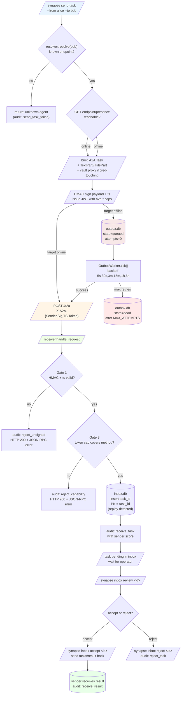

<!-- SPDX-License-Identifier: Apache-2.0 -->

# A2A task flow

> Source: `packages/synapse-cli/synapse_cli/commands/send_task.py`, `transport.py`, `receiver.py`, `outbox_store.py`, `outbox_worker.py`, `inbox_store.py`, `commands/inbox.py`.

## What lives where

| State | Storage | Lifetime |
|---|---|---|
| Outbox row | `outbox.db` (SQLite WAL) | Until `purge_sent` or `state=dead` cleared by operator |
| Inbox row | `inbox.db` (SQLite) | Until operator's `accept` / `reject` (then `status` updated; row remains for audit) |
| Audit entries | `audit.jsonl` | Append-only, forever |
| Blob cache (sender side) | `blobs/<sha256[:2]>/<sha256>` | Until operator clears |
