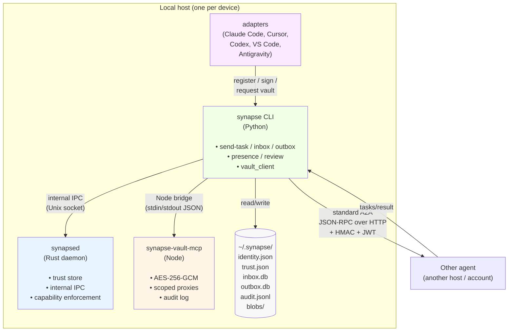

<!-- SPDX-License-Identifier: Apache-2.0 -->

# High-level architecture

> Source of truth: `daemon/src/`, `packages/synapse-core/`, `packages/synapse-vault-mcp/`, `packages/synapse-cli/`, `packages/adapters/`.

## What each box owns

| Component | Owns |
|---|---|
| **synapsed** (Rust daemon) | Trust store, internal IPC protocol, capability enforcement on each TrustOp. Not on the A2A path. |
| **synapse CLI** (Python) | The actual A2A endpoints. send-task, inbox, outbox, presence, review. Issues tokens. Verifies signatures. Enforces capability on inbound A2A. |
| **synapse-vault-mcp** (Node) | The only place a raw secret exists at rest. Issues proxy tokens. Resolves proxies. |
| **adapters** (Python) | Thin wrappers that give Claude Code / Cursor / etc. a uniform `register` + `sign_message` + `request_vault_credential` API. |
| **~/.synapse/** | All persistent state. Backup-friendly, inspect-friendly. |
