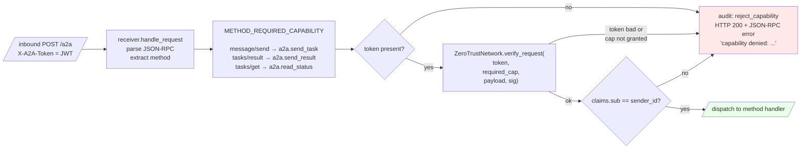
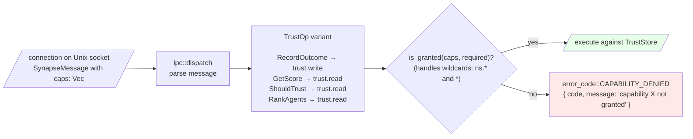

<!-- SPDX-License-Identifier: Apache-2.0 -->

# Capability enforcement flow

> Source: `packages/synapse-core/synapse/security/capabilities.py`, `packages/synapse-cli/synapse_cli/receiver.py` (`METHOD_REQUIRED_CAPABILITY`, `_check_capability`), `daemon/src/ipc/mod.rs` (`required_capability_for`).

## A2A receiver — per RPC method

## Rust daemon IPC — per TrustOp

## Capability vocabulary (subset)

| Capability | Granted by default? | Used by |
|---|---|---|
| `a2a.send_task` | Yes (default A2A grant) | Sender — A2A `message/send` |
| `a2a.send_result` | Yes (default A2A grant) | Receiver-acting-as-sender — A2A `tasks/result` |
| `a2a.read_status` | Yes (default A2A grant) | Either side — A2A `tasks/get` |
| `trust.read` | No | Rust IPC clients reading reputation |
| `trust.write` | No | Rust IPC clients recording outcomes |
| `vault.request_credential` | No | Adapters requesting a proxy |
| `vault.store_secret` | No | Operator-only on the laptop |
| `*` | Reserved for the daemon's self-signed requests | Never grant to a remote agent |
