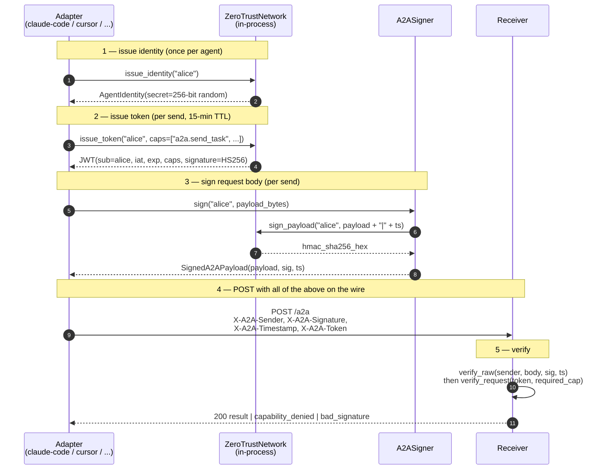

<!-- SPDX-License-Identifier: Apache-2.0 -->

# Identity flow

> Source: `packages/synapse-core/synapse/security/zero_trust.py`, `packages/synapse-cli/synapse_cli/a2a_signer.py`.

## Where each piece is stored

| Material | Lifetime | Stored where |
|---|---|---|
| Agent HMAC secret | persistent per agent | `ZeroTrustNetwork._secrets` (process memory). Persistent agents must re-issue at startup or persist out-of-band. |
| JWT | 15 min | not stored — issued per send |
| HMAC signature | per request | bound into HTTP headers, never persisted on the sender side |
