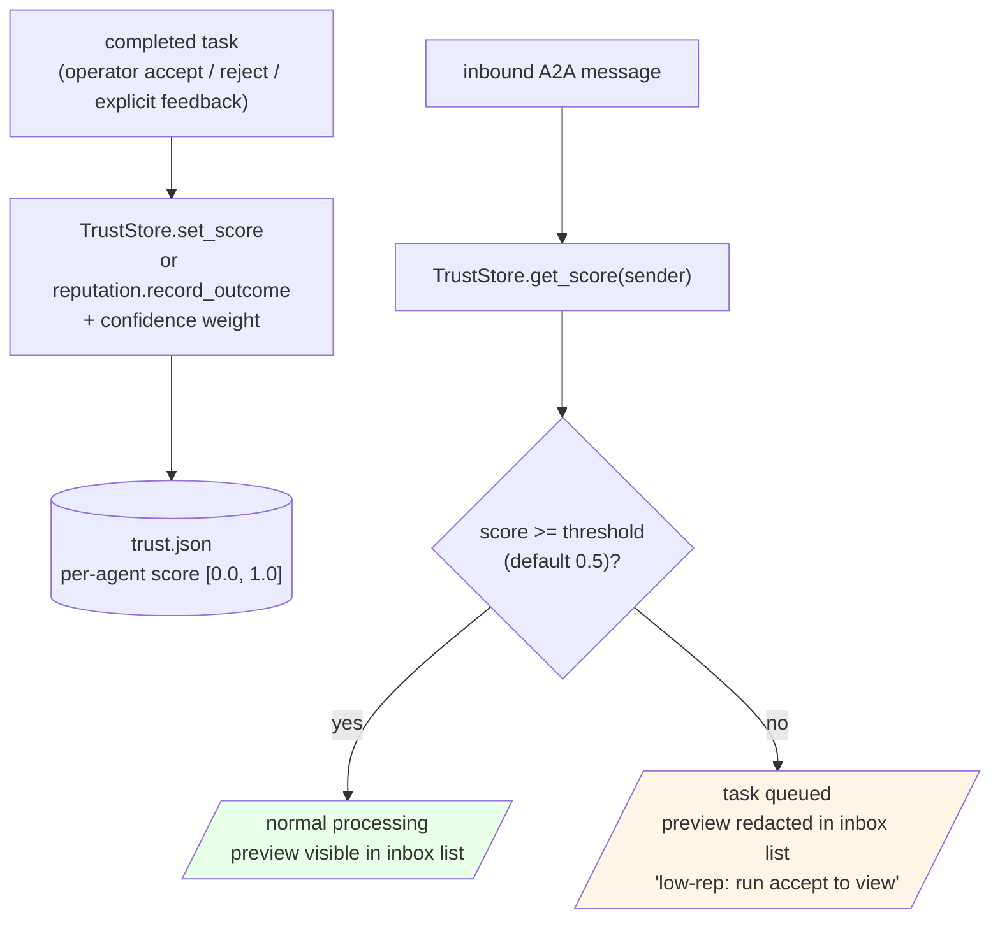

<!-- SPDX-License-Identifier: Apache-2.0 -->

# Trust / reputation flow

> Source: `packages/synapse-cli/synapse_cli/trust.py` (v0.1-authoritative Python store), `daemon/src/trust/reputation.rs` (Rust mirror — in-memory in v0.1).

## Score semantics

| Range | Treatment |
|---|---|
| `>= 0.5` (threshold) | Normal processing. Preview shown in `synapse inbox list`. |
| `< 0.5` | Queued but **content redacted** in `inbox list`. Operator must `accept` to view. `review` reveals content explicitly. |
| `0.0` | Effectively blocked — content always redacted until accept. |

Threshold is per-call (`DEFAULT_TRUST_THRESHOLD` constant). Operator can tune by passing `--confirm` to override on a single send.

## Authoritative store note (v0.1)

Two stores exist. **The Python store is authoritative.** The Rust store is mirror infrastructure being filled in over subsequent releases. Diagram above is the Python store; the Rust store accepts the same TrustOps over IPC and applies the same logic, but does not feed back into the CLI's `trust.json` in v0.1.

If you read `get_score` from the Rust daemon directly, you may get a different answer than the Python CLI. Documented in [`docs/ARCHITECTURE.md`](../ARCHITECTURE.md) and [`KNOWN_LIMITATIONS.md`](../../KNOWN_LIMITATIONS.md) (T-2).
