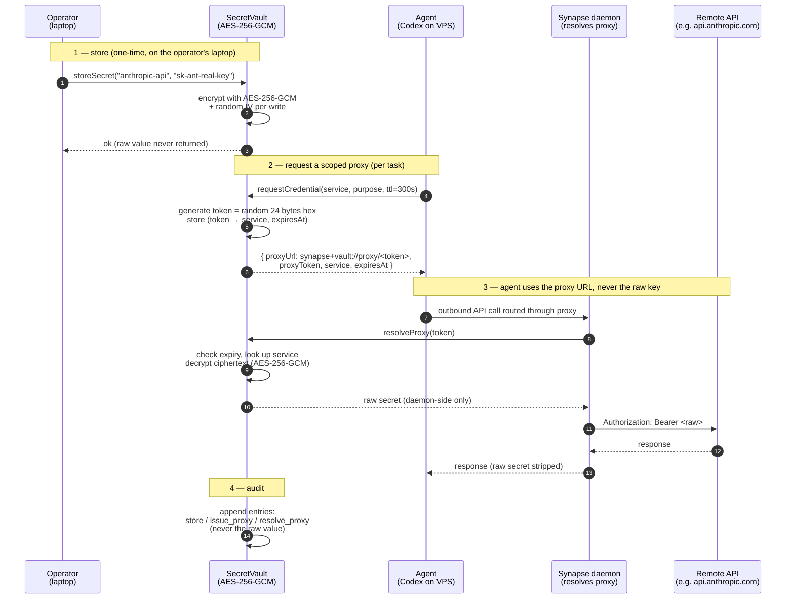

<!-- SPDX-License-Identifier: Apache-2.0 -->

# Vault flow

> Source: `packages/synapse-vault-mcp/src/vault.ts`, `packages/synapse-cli/synapse_cli/vault_client.py`.

## Invariants

- **Raw secret never returns through `requestCredential`.** Agents always get a proxy.
- **Raw secret never crosses the A2A wire.** The vault MCP runs locally on the operator's laptop; only the daemon resolves the proxy at the network egress point.
- **Every action audited.** `audit_log()` returns `{ action, name, at, purpose }`. The value never appears.
- **Tampered ciphertext fails GCM auth tag check on decrypt.** Test: `tampered ciphertext is rejected on decrypt`.
